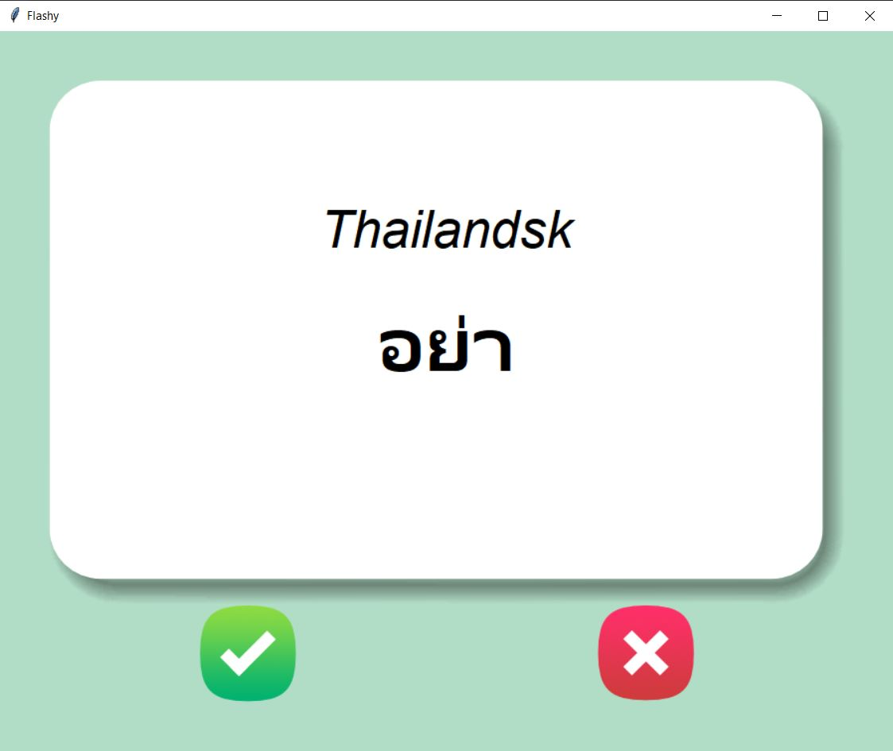
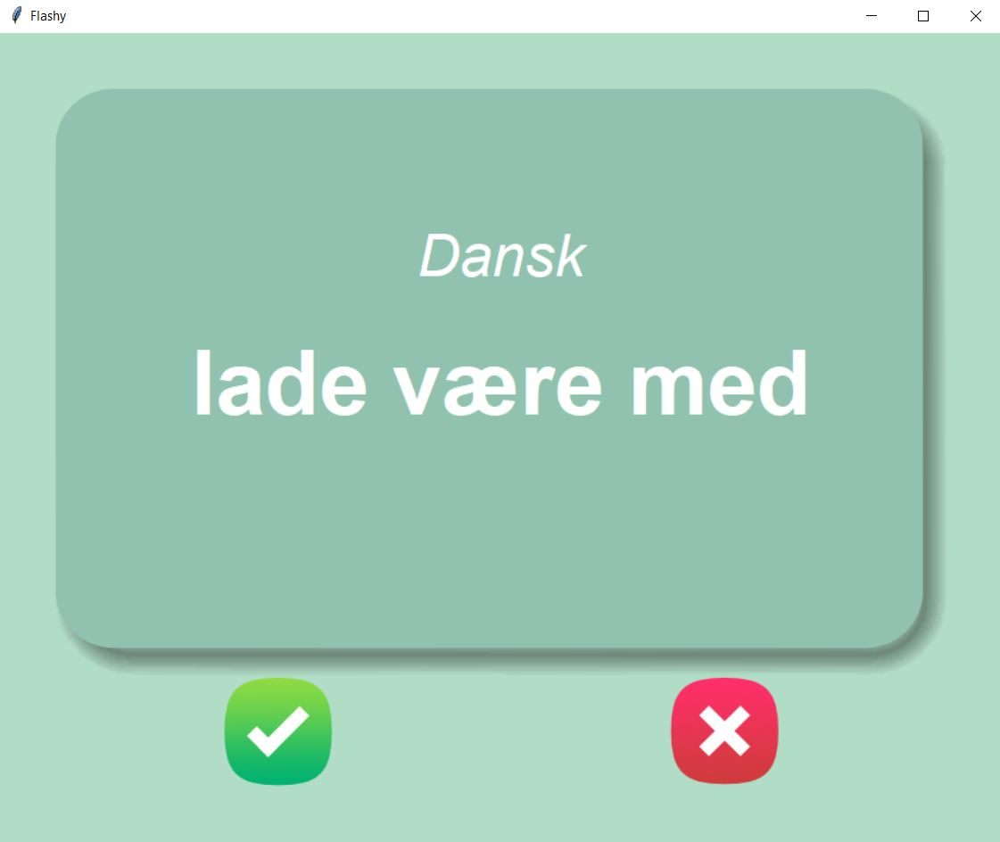

# Flash Card App
A flash card app meant to be used for learning the Thai language and based on the most used words in Thai television (movies and tv-series). It was developed with the TKinter lib.

